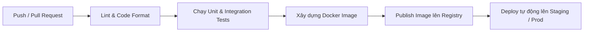

# Deployment Plan - AI Smart Travel Planner

## 1. Môi trường triển khai (Environments)
Hệ thống được thiết lập vận hành trên 3 môi trường tách biệt:

- **Local**: Môi trường chạy trên máy cá nhân của lập trình viên, sử dụng Docker Compose để tạo nhanh database và cache.
- **Staging**: Môi trường thử nghiệm dùng để kiểm thử tích hợp và demo tính năng. Môi trường này sử dụng cấu hình phần cứng gần tương đồng với môi trường chạy thật.
- **Production**: Môi trường thực tế phục vụ người dùng cuối. Yêu cầu tính ổn định, giám sát chặt chẽ và bảo mật tối đa.

---

## 2. Dockerization (Đóng gói Container)
Ứng dụng backend Spring Boot được đóng gói sử dụng kỹ thuật **Multi-stage build** trong Dockerfile nhằm tối thiểu hóa kích thước Image cuối cùng và tăng tính bảo mật (loại bỏ SDK Gradle ở image chạy cuối).

### Dockerfile Backend (Spring Boot):
```dockerfile
# Stage 1: Build the application
FROM eclipse-temurin:21-jdk-alpine AS build
WORKDIR /app
COPY . .
RUN ./gradlew bootJar --no-daemon

# Stage 2: Run the application
FROM eclipse-temurin:21-jre-alpine
WORKDIR /app
RUN addgroup -S spring && adduser -S spring -G spring
USER spring:spring
COPY --from:build /app/build/libs/*.jar app.jar
ENTRYPOINT ["java", "-jar", "app.jar"]
```

### Docker Compose Local (`docker-compose.yml`):
Sử dụng cho môi trường Local để khởi động nhanh PostgreSQL có PostGIS và Redis:
```yaml
services:
  postgres:
    image: postgis/postgis:16-3.4-alpine
    container_name: tripwise-db-local
    environment:
      POSTGRES_DB: tripwise
      POSTGRES_USER: tripwise_user
      POSTGRES_PASSWORD: tripwise_secure_password
    ports:
      - "5432:5432"
    volumes:
      - pgdata:/var/lib/postgresql/data

  redis:
    image: redis:7.2-alpine
    container_name: tripwise-cache-local
    ports:
      - "6379:6379"

volumes:
  pgdata:
```

---

## 3. Pipeline CI/CD (GitHub Actions)
Hệ thống sử dụng GitHub Actions để tự động hóa quy trình kiểm thử và phát hành phiên bản mới:



- **Bước 1: Tích hợp liên tục (CI)**:
  - Khi có code push lên branch `main` hoặc `develop`, pipeline sẽ kích hoạt chạy kiểm thử đơn vị, kiểm thử tích hợp (sử dụng PostgreSQL + Redis trong GitHub runner dịch vụ).
  - Kiểm tra tiêu chuẩn chất lượng và lỗ hổng bảo mật của dependency.
- **Bước 2: Triển khai liên tục (CD)**:
  - Khi kiểm thử thành công và code được merge vào branch release, GitHub Actions tự động build Docker Image mới và push lên Docker Registry (Docker Hub / AWS ECR).
  - Thực hiện ssh vào server và cập nhật image mới mà không gây gián đoạn dịch vụ lớn (Zero-downtime deployment sử dụng Blue-Green deployment).

---

## 4. Quản lý cấu hình & Secret (Secret Management)
- **Quy tắc tuyệt đối**: Không được lưu trữ mật khẩu DB, JWT Secret Key, API Key của Gemini/OpenWeather trực tiếp trong tệp cấu hình ứng dụng (`application.yml`) được commit lên Git.
- **Hiện thực**:
  - Tận dụng cơ chế đọc biến môi trường của Spring Boot để ánh xạ giá trị vào tệp cấu hình:
    ```yaml
    spring:
      datasource:
        url: ${SPRING_DATASOURCE_URL}
        username: ${SPRING_DATASOURCE_USERNAME}
        password: ${SPRING_DATASOURCE_PASSWORD}
    ```
  - Trên môi trường local, các biến này được khai báo trong tệp `.env` (nằm trong danh sách `.gitignore`).
  - Trên môi trường Staging/Production, các giá trị này được cấu hình an toàn bằng tính năng **Secrets** của nền tảng triển khai (GitHub Secrets, AWS Secrets Manager, hoặc HashiCorp Vault).

---

## 5. Chiến lược chạy Migration & Rollback
- **Database Migration**:
  - Mọi sự thay đổi cấu trúc bảng, thêm cột hoặc dữ liệu tĩnh khởi tạo (Seed data) bắt buộc phải viết thông qua các tệp SQL Migration của Flyway (đặt trong `src/main/resources/db/migration`).
  - Khi ứng dụng khởi chạy ở bất kỳ môi trường nào, Flyway sẽ tự động kiểm tra và chạy các tệp migration mới theo thứ tự ID định sẵn.
- **Chiến lược Rollback (Lùi phiên bản)**:
  - **Rollback Code**: Khi phiên bản ứng dụng mới gặp lỗi nghiêm trọng trên Production, nhanh chóng đổi cấu hình tag của Container trên server về tag của phiên bản chạy ổn định trước đó.
  - **Rollback Database**: Do Flyway không tự động rollback cấu trúc DB (đặc biệt là môi trường Community Edition), mọi tệp migration làm thay đổi cấu trúc dữ liệu phải được thiết kế để tương thích ngược (không xóa cột cũ ngay lập tức) hoặc chuẩn bị sẵn tệp SQL rollback thủ công để chạy khi có sự cố.
