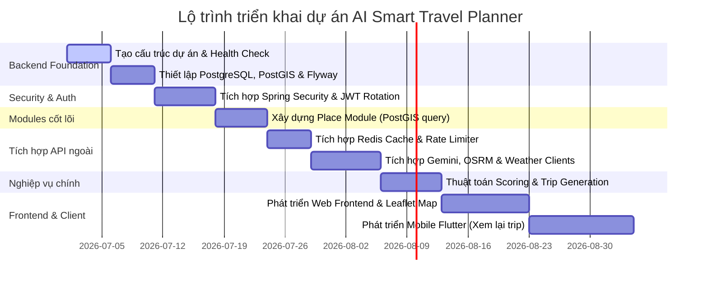

# Implementation Plan - AI Smart Travel Planner

## 1. Chiến lược phát triển Modular Monolith
Dự án được xây dựng dưới dạng **Modular Monolith** nhằm tối ưu hóa tốc độ phát triển và đơn giản hóa quá trình triển khai trong giai đoạn đầu (MVP). 

### Quy tắc phân ranh giới Module:
- Mỗi module nghiệp vụ chính (`auth`, `place`, `trip`, `route`, `weather`) phải tự chứa logic của riêng nó.
- Giao tiếp giữa các module phải được thực hiện thông qua **Interfaces (Ports)** của Application Layer hoặc thông qua các lớp Application Services được định nghĩa rõ ràng. Không cho phép module này truy vấn trực tiếp vào database table hoặc Persistence Adapter của module khác.

```text
[Web / Mobile Client]
         │
         ▼
[Presentation Layer (REST Controllers)]
         │
         ▼
[Application Layer (Use Cases & Ports)] ◄─── Module Boundary ───► [Other Modules]
         │
         ▼
[Infrastructure Layer (JPA, Redis, API Clients)]
```

---

## 2. Lộ trình phát triển và thứ tự triển khai (Phase-by-Phase)

Để đảm bảo hệ thống được xây dựng trên một nền móng vững chắc, thứ tự triển khai các cấu phần kỹ thuật được sắp xếp như sau:



1. **Bước 1: Backend Foundation (Phase 1)**
   - Setup dự án Spring Boot sử dụng Java 21. Cấu hình kiểm tra sức khỏe hệ thống (Actuator Health Endpoint) và cấu hình xử lý ngoại lệ tập trung (Global Exception Handling).
2. **Bước 2: Database Migration (Phase 2)**
   - Tích hợp Flyway. Tạo migration tạo bảng `users`, `places_geo` (có spatial index), `itineraries`, `itinerary_days`, `itinerary_items`, `route_cache` và `weather_cache`.
3. **Bước 3: Auth & Security (Phase 3)**
   - Triển khai Spring Security, phân quyền dựa trên Role (User, Admin). Hiện thực luồng đăng nhập, cấp JWT Access Token và Refresh Token Rotation. Che giấu log thông tin nhạy cảm.
4. **Bước 4: Place Module (Phase 4)**
   - Viết API CRUD địa điểm cho Admin và API tìm kiếm địa điểm công khai. Tích hợp truy vấn địa lý của PostGIS để lọc địa điểm theo bán kính hoặc khu vực.
5. **Bước 5: Caching & External Client Integration (Phase 5, 7, 9, 10)**
   - Tích hợp Redis. Hiện thực Gemini Adapter (parse prompt sang JSON), OSRM Adapter (tính toán tuyến đường và nén geometry), và Weather Adapter.
6. **Bước 6: Core Trip Generation Logic (Phase 6, 8)**
   - Hiện thực thuật toán chấm điểm (Place Scoring) theo sở thích/ngân sách. Viết Use Case tạo lịch trình và tự động tối ưu hóa thứ tự di chuyển (Nearest Neighbor).
7. **Bước 7: Web Frontend & Leaflet (Phase 11)**
   - Xây dựng giao diện nhập prompt và hiển thị lịch trình kèm bản đồ Leaflet vẽ polyline thực tế.
8. **Bước 8: Flutter Mobile (Phase 12)**
   - Xây dựng ứng dụng Flutter di động, kết nối API lấy danh sách chuyến đi đã lưu của user.

---

## 3. Nguyên tắc lập trình nhiệm vụ nhỏ (Micro-task Development)
Để duy trì chất lượng mã nguồn và dễ dàng kiểm soát rủi ro, mọi thành viên phát triển và AI Coding Assistant phải tuân thủ các nguyên tắc sau:

- **Một task mỗi lần**: Tuyệt đối không thực hiện song song hoặc code lan man sang các tính năng nằm ngoài phạm vi Acceptance Criteria của task hiện tại.
- **Không tự ý thêm Dependency**: Việc thêm bất kỳ thư viện bên ngoài (Gradle/NPM) nào vào dự án đều phải được đánh giá kỹ về kích thước, lỗ hổng bảo mật và sự đồng thuận của trưởng nhóm.
- **Bảo vệ ranh giới thiết kế**:
  - Không được đưa business logic (quy tắc chấm điểm, tối ưu quãng đường) vào Controller.
  - Không sử dụng thực thể cơ sở dữ liệu (JPA Entity) để làm dữ liệu trả về trực tiếp cho API; bắt buộc phải mapping qua DTO.
- **Chưa vội làm Microservices**: Tập trung hoàn thiện kiến trúc Modular Monolith chạy ổn định trên một cơ sở dữ liệu duy nhất (PostgreSQL). Chỉ xem xét phân tách thành microservices khi hệ thống gặp vấn đề quá tải thực sự ở một module cụ thể (như module tính toán tuyến đường OSRM) hoặc khi đội ngũ phát triển phình to.
