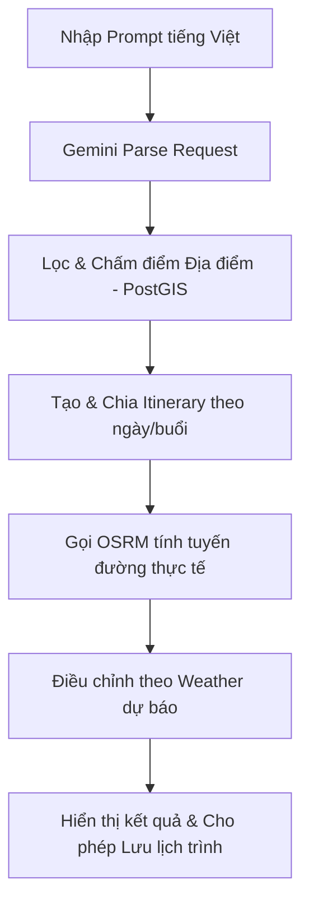

# Requirement Analysis - AI Smart Travel Planner

## 1. Business Requirements (Yêu cầu kinh doanh)
- **Mục tiêu sản phẩm**: Xây dựng một nền tảng lập lịch trình du lịch thông minh, giúp người dùng tiết kiệm thời gian lập kế hoạch và tối ưu hóa trải nghiệm di chuyển tại thực địa.
- **Giá trị cốt lõi**:
  - Tự động hóa việc phân tích nhu cầu tự nhiên của người dùng bằng AI.
  - Cung cấp lịch trình thực tế, khả thi dựa trên địa điểm có thật và hạ tầng giao thông thực tế.
  - Kiểm soát chi phí vận hành bằng hệ thống cache và thuật toán tối ưu, không phụ thuộc hoàn toàn vào các dịch vụ bản đồ đắt đỏ.
  - Chuẩn bị nền tảng dữ liệu địa phương vững chắc để mở rộng sang các dịch vụ gia tăng giá trị (đặt phòng, bán vé, liên kết đại lý du lịch).

---

## 2. User Requirements (Yêu cầu người dùng)
- **Đối tượng mục tiêu**: Người du lịch tự túc phổ thông (học sinh, sinh viên, nhóm bạn trẻ, cặp đôi, gia đình) và người bận rộn muốn lên kế hoạch du lịch nhanh chóng.
- **Mong muốn chính của người dùng**:
  - Muốn nhập mong muốn chuyến đi bằng ngôn ngữ tự nhiên tiếng Việt thay vì phải chọn nhiều biểu mẫu phức tạp.
  - Lịch trình nhận được phải hợp lý: Điểm tham quan không quá xa nhau trong một ngày, thời gian di chuyển giữa các điểm ngắn nhất có thể.
  - Lịch trình phải thích ứng với thời tiết (ví dụ: ngày mưa thì đi bảo tàng/cafe trong nhà).
  - Có thể lưu trữ lịch trình để mở lại xem bằng điện thoại bất cứ lúc nào trong suốt hành trình.

---

## 3. Functional Requirements (Yêu cầu chức năng)

- **FR-001: Nhập yêu cầu du lịch**: Hỗ trợ form nhập ngôn ngữ tự nhiên tiếng Việt, ngày khởi hành và điểm xuất phát.
- **FR-002: AI Phân tích yêu cầu**: Sử dụng Gemini API để bóc tách nhu cầu thành cấu trúc JSON (Điểm đến, số ngày/đêm, sở thích, ngân sách, phong cách).
- **FR-003: Quản lý địa điểm**: Lưu trữ và truy vấn địa điểm thực tế từ cơ sở dữ liệu.
- **FR-004: Chấm điểm địa điểm**: Thuật toán tính điểm (Place Scoring) dựa theo tags trùng khớp sở thích, ngân sách và thời tiết.
- **FR-005: Tạo lịch trình**: Phân phối các điểm tham quan vào các ngày và khung giờ (Sáng, Trưa, Chiều, Tối).
- **FR-006: Tính toán tuyến đường thực tế**: Gọi OSRM API lấy khoảng cách, thời gian di chuyển và danh sách tọa độ (geometry) của tuyến đường.
- **FR-007: Điều chỉnh theo thời tiết**: Sử dụng API thời tiết để cập nhật lịch trình (ưu tiên điểm trong nhà nếu trời mưa).
- **FR-008: Gợi ý khách sạn & phương tiện**: Đưa ra gợi ý thông tin lưu trú và di chuyển dựa trên dữ liệu chuẩn hóa của hệ thống.
- **FR-009: Quản lý lịch trình**: Người dùng đăng nhập có thể lưu, xem danh sách và xóa lịch trình của cá nhân.
- **FR-010: Quản trị hệ thống (Admin)**: CRUD địa điểm, import dữ liệu thô và xem trạng thái đồng bộ địa điểm.

---

## 4. Non-functional Requirements (Yêu cầu phi chức năng)
- **Độ tin cậy (Reliability)**: Khi các API bên ngoài (Gemini, OSRM, Weather) gặp sự cố, hệ thống phải kích hoạt cơ chế fallback và thông báo lỗi rõ ràng cho người dùng mà không làm sập ứng dụng.
- **Khả năng bảo trì (Maintainability)**:
  - Backend phải tuân thủ nghiêm ngặt **Clean Architecture** và cấu trúc **Modular Monolith**.
  - Logic nghiệp vụ không được trộn lẫn vào Presentation (Controller) hay Infrastructure (Database/API adapters).
  - Sử dụng DTO riêng biệt cho API Request/Response.

---

## 5. Security Requirements (Yêu cầu bảo mật)
- **Quản lý Token**: Hệ thống sử dụng cơ chế xác thực OAuth2 kết hợp JWT access token ngắn hạn (15-30 phút) và refresh token rotation (lưu dạng hash) để chống giả mạo và reuse token.
- **Quản lý Secret**: Tuyệt đối không commit API key (Gemini, Weather), DB password hoặc JWT secret lên Git. Toàn bộ secret được cấu hình qua biến môi trường.
- **Bảo mật API**:
  - Không để lộ log lỗi chi tiết (stack trace) ra client.
  - Sử dụng Rate Limiting tại các endpoint tốn chi phí (tạo chuyến đi) hoặc nhạy cảm (auth).
  - CORS cấu hình domain cụ thể, không sử dụng wildcard (`*`) trên môi trường sản xuất.

---

## 6. Scalability Requirements (Yêu cầu mở rộng)
- **Kiến trúc Monolith mở**: Cấu trúc Modular Monolith cho phép dễ dàng tách các module nghiệp vụ như `place`, `route`, `trip` thành các microservices độc lập trong tương lai nếu có yêu cầu về quy mô hoặc đội ngũ phát triển.
- **Độc lập Client**: API được thiết kế độc lập với Web browser hoặc Mobile app, sử dụng phiên bản `/api/v1` thống nhất.
- **Khả năng mở rộng địa lý**: Dữ liệu lưu trữ trong PostgreSQL hỗ trợ chỉ mục không gian (spatial index) cho phép dễ dàng tích hợp thêm các thành phố mới bên ngoài Nha Trang mà không cần viết lại cấu trúc truy vấn.

---

## 7. Performance Requirements (Yêu cầu hiệu năng)
- **Thời gian phản hồi (Response Time)**:
  - API đọc dữ liệu tĩnh/đã cache (saved trips, place search): `< 300ms`.
  - API tạo lịch trình mới (gồm AI + OSRM + Weather): Chấp nhận dưới `5s` nhưng giao diện client phải hiển thị thanh loading/progress rõ ràng cho người dùng.
- **Tối ưu hóa tài nguyên**:
  - Bắt buộc cache kết quả tuyến đường OSRM theo cặp điểm (`from_place_id`, `to_place_id`, `profile`) để hạn chế gọi lại API ngoài.
  - Sử dụng cache Redis cho dữ liệu thời tiết của thành phố theo ngày (expiry TTL `6 - 12 giờ`).

---

## 8. Data Requirements (Yêu cầu dữ liệu)
- **Tính toàn vẹn dữ liệu địa lý**: Dữ liệu tọa độ của địa điểm, khách sạn và tuyến đường phải sử dụng hệ tọa độ chuẩn **WGS 84 (EPSG:4326)** và kiểu dữ liệu PostGIS phù hợp (`geography(Point, 4326)` hoặc `geometry(Point, 4326)`).
- **Chuẩn hóa dữ liệu thô**: Dữ liệu từ các API ngoài (Google Places, OpenStreetMap) trước khi đưa vào cơ sở dữ liệu production phải được ánh xạ qua các lớp trung gian để chuẩn hóa cấu trúc dữ liệu theo schema của dự án.

---

## 9. External API Requirements (Yêu cầu tích hợp API ngoài)
- **Gemini API**: Thiết lập timeout tối đa `10000ms`, có cơ chế parse fallback tự viết khi Gemini trả cấu trúc JSON không hợp lệ.
- **OSRM API**: Hạn chế gọi OSRM liên tục theo thao tác kéo bản đồ của người dùng. Ưu tiên gom nhóm các điểm cần tính toán và thực hiện gọi hàng loạt (batch request).
- **Weather API (Open-Meteo/OpenWeather)**: Thiết lập timeout `3000ms`, có cơ chế cache và fallback sử dụng dữ liệu thời tiết mặc định gần nhất trong DB khi API ngoài gặp sự cố.
