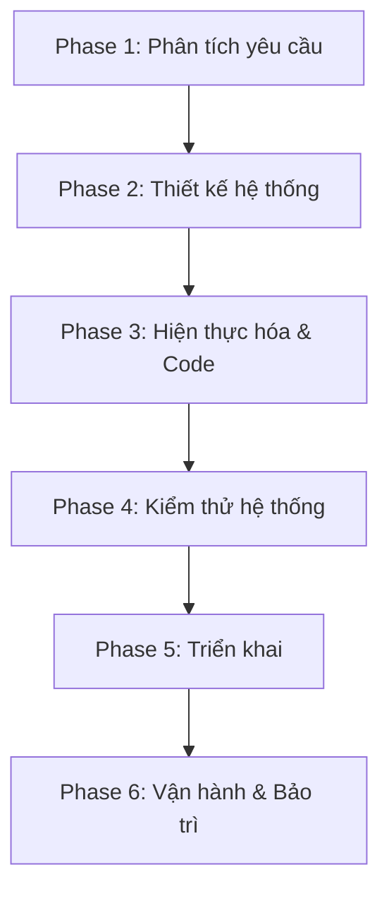

# SDLC Plan - AI Smart Travel Planner

## 1. Tổng quan quy trình SDLC của dự án
Dự án **AI Smart Travel Planner** áp dụng quy trình phát triển phần mềm kết hợp giữa mô hình **Vòng đời phát triển phần mềm truyền thống (SDLC)** để định hình các mốc quan trọng và phương pháp **Agile Scrum** để phát triển các tính năng theo cách lặp (iterative) và tăng trưởng (incremental). 

Quy trình này đảm bảo tính kỷ luật trong thiết kế kiến trúc hệ thống (Clean Architecture, Modular Monolith) đồng thời duy trì sự linh hoạt trong quá trình hiện thực hóa các chức năng thực tế của MVP (như tích hợp Gemini API, OSRM, Weather API).

---

## 2. Các phase trong quy trình phát triển
Quy trình phát triển được chia thành 6 phase chính, tương ứng với dòng chảy công việc chuẩn của kỹ thuật phần mềm:

1. **Phase 1: Requirement Analysis (Phân tích yêu cầu)**: Xác định rõ ràng các yêu cầu chức năng (FR), phi chức năng (NFR), bảo mật, mở rộng và dữ liệu cho MVP (Nha Trang, 1-3 ngày).
2. **Phase 2: System Design (Thiết kế hệ thống)**: Thiết kế kiến trúc tổng thể, mô hình dữ liệu quan hệ địa lý (PostGIS), thiết kế API phiên bản `/api/v1` và cơ chế caching (Redis).
3. **Phase 3: Implementation (Hiện thực hóa & Lập trình)**: Phát triển mã nguồn Spring Boot (Java 21) dựa trên Clean Architecture, kết hợp Web client Next.js và chuẩn bị cho Flutter mobile.
4. **Phase 4: Testing (Kiểm thử)**: Thực hiện từ Unit test đến Integration test, API test, kiểm tra tính chịu lỗi của API ngoài (Gemini/OSRM/Weather) và kiểm thử thủ công UI.
5. **Phase 5: Deployment (Triển khai)**: Đóng gói ứng dụng bằng Docker, thiết lập pipeline CI/CD, chuẩn bị môi trường chạy thật và quản lý biến môi trường.
6. **Phase 6: Maintenance (Vận hành & Bảo trì)**: Giám sát log, theo dõi lỗi, tối ưu hiệu năng DB, sao lưu dữ liệu và kiểm soát chi phí gọi API ngoài.

---

## 3. Chi tiết Input/Output của từng phase

| Phase | Input | Output |
| :--- | :--- | :--- |
| **1. Phân tích yêu cầu** | Ý tưởng dự án, tài liệu Vision, đặc tả Product | File `requirement-analysis.md`, tài liệu MVP Scope |
| **2. Thiết kế hệ thống** | Yêu cầu nghiệp vụ và kỹ thuật đã thống nhất | File `system-design.md`, Database Schema (Flyway sql), API Spec |
| **3. Hiện thực hóa** | Thiết kế hệ thống, sơ đồ lớp, API Spec | Mã nguồn backend/frontend chạy được, file `implementation-plan.md` |
| **4. Kiểm thử** | Mã nguồn hiện có, kịch bản test | File `testing-plan.md`, báo cáo kết quả kiểm thử (Test Report) |
| **5. Triển khai** | Build artifacts, Dockerfile, env config | File `deployment-plan.md`, hệ thống chạy thật trên Staging/Production |
| **6. Vận hành & Bảo trì** | Phản hồi của người dùng, báo cáo lỗi, log runtime | File `maintenance-plan.md`, các bản vá lỗi (hotfix), báo cáo tối ưu chi phí |

---

## 4. Cách sử dụng tài liệu dành cho Con người và AI Coding Assistant

### 4.1 Đối với Developer (Con người)
- **Định hướng chiến lược**: Sử dụng tài liệu này để kiểm soát tiến độ tổng thể của dự án, đảm bảo không bỏ qua bất kỳ bước kiểm tra bảo mật hoặc tối ưu hóa nào trước khi đưa sản phẩm ra thực tế.
- **Tiêu chuẩn kiểm duyệt (DoD)**: Làm căn cứ để đánh giá chất lượng code của bản thân và đồng nghiệp trước khi đưa vào merge branch chính.
- **Lập kế hoạch Sprint**: Sử dụng các mốc SDLC để chia nhỏ backlog thành các task chạy trong từng Sprint (1-2 tuần).

### 4.2 Đối với AI Coding Assistant
- **Ranh giới hoạt động**: AI bắt buộc phải đọc chuỗi tài liệu SDLC này trước khi viết hoặc chỉnh sửa bất kỳ dòng code nào. AI tuyệt đối **không được tự ý thay đổi** kiến trúc cốt lõi (ví dụ: chuyển từ PostgreSQL sang MongoDB, tự ý viết microservices hoặc code lan sang module khác ngoài phạm vi được chỉ định).
- **Quy trình làm việc nghiêm ngặt**:
  1. Đọc kỹ file yêu cầu tương ứng với task (`requirement-analysis.md`).
  2. Đối chiếu thiết kế cấu trúc lớp và database (`system-design.md`).
  3. Viết code theo quy tắc của `implementation-plan.md` (chỉ làm một task nhỏ mỗi lần, Clean Architecture).
  4. Đề xuất kịch bản kiểm thử khớp với `testing-plan.md`.
  5. Đóng gói hoặc cấu hình theo chỉ dẫn tại `deployment-plan.md`.
