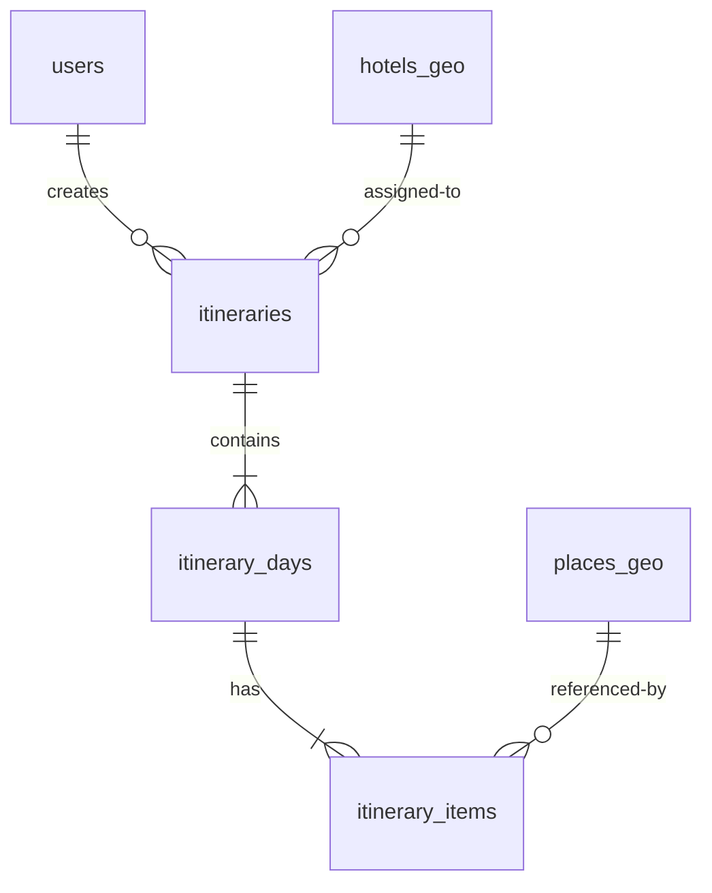

# System Design - AI Smart Travel Planner

## 1. High-Level Architecture (Kiến trúc mức cao)
Hệ thống sử dụng mô hình **Modular Monolith** kết hợp **Clean Architecture** ở phía backend, tách biệt hoàn toàn với các ứng dụng client (Web/Mobile). 

```text
┌────────────────────────────────────────────────────────┐
│                        CLIENTS                         │
│   ┌─────────────────────┐       ┌──────────────────┐   │
│   │  React / Next.js    │       │     Flutter      │   │
│   └──────────┬──────────┘       └────────┬─────────┘   │
└──────────────┼───────────────────────────┼─────────────┘
               │ HTTPS (REST API /api/v1)  │
               └─────────────┬─────────────┘
                             ▼
┌────────────────────────────────────────────────────────┐
│                        BACKEND                         │
│   ┌────────────────────────────────────────────────┐   │
│   │                  Spring Boot                   │   │
│   │  [Auth] [User] [Place] [Trip] [Route] [Weather]│   │
│   └──────┬───────────┬────────────┬────────────┬───┘   │
└──────────┼───────────┼────────────┼────────────┼───────┘
           │           │            │            │
           ▼           ▼            ▼            ▼
     ┌───────────┐ ┌───────┐ ┌─────────────┐ ┌───────┐
     │PostgreSQL │ │ Redis │ │ External    │ │Object │
     │  PostGIS  │ │ Cache │ │ OSRM/Gemini │ │Storage│
     └───────────┘ └───────┘ └─────────────┘ └───────┘
```

---

## 2. Backend Spring Boot (Clean Architecture)
Backend được tổ chức thành các module nghiệp vụ tách biệt. Mỗi module tuân thủ cấu trúc 4 lớp của Clean Architecture:

1. **Domain Layer**: 
   - Chứa thực thể nghiệp vụ (`Domain Entity`), các logic thuần túy không phụ thuộc framework (`Domain Service`), và các `Value Object`.
2. **Application Layer**:
   - Chứa luồng nghiệp vụ (`Use Cases`), định nghĩa các cổng giao tiếp vào (`Port In`) và cổng giao tiếp ra (`Port Out` - Interfaces).
3. **Infrastructure Layer**:
   - Hiện thực các `Port Out` thông qua các Adapter: `Persistence Adapter` (JPA/Flyway), `External API Adapter` (Gemini, OSRM, Weather Client), `Cache Adapter` (Redis).
4. **Presentation Layer**:
   - Chứa `REST Controller`, validate dữ liệu đầu vào và thực hiện ánh xạ qua `DTO` bằng `Mapstruct`.

---

## 3. Web Frontend & Flutter Mobile
- **Web Frontend**: Phát triển trên nền tảng **ReactJS hoặc Next.js**, giao tiếp hoàn toàn qua REST API. Sử dụng **Leaflet** cùng với nguồn bản đồ mở **OpenStreetMap** để kết xuất giao diện bản đồ, đánh dấu địa điểm (markers) và vẽ tuyến đường (polylines) mà không phát sinh chi phí.
- **Flutter Mobile**: Xây dựng ứng dụng đa nền tảng cho Android và iOS, tập trung tối ưu hóa trải nghiệm xem lại lịch trình đã lưu khi đang di chuyển ngoại tuyến (offline snapshot). Token được bảo vệ an toàn bằng `Flutter Secure Storage`.

---

## 4. PostgreSQL + PostGIS (Database Design)
Database sử dụng PostgreSQL kết hợp extension **PostGIS** để xử lý thông tin không gian. 



### Các bảng dữ liệu không gian chính:
- **`places_geo`**: Lưu trữ thông tin địa điểm du lịch. Trường vị trí dùng kiểu dữ liệu `geography(Point, 4326)` để tính khoảng cách chính xác. Có chỉ mục không gian GIST:
  ```sql
  CREATE INDEX idx_places_geo_location ON places_geo USING GIST (location);
  ```
- **`hotels_geo`**: Lưu trữ các khách sạn được chuẩn hóa từ OpenStreetMap POI hoặc Google Places API.
- **`route_cache_geo`**: Cache tuyến đường đi giữa các địa điểm. Lưu trữ trường `geometry` dạng `geography(LineString, 4326)` để trực tiếp lấy dữ liệu vẽ polyline mà không cần gọi lại OSRM.

---

## 5. Redis Cache Strategy
Redis được sử dụng làm bộ đệm hiệu năng cao nhằm tối ưu hóa chi phí API và cải thiện thời gian phản hồi:
- **Weather Cache**: Lưu trữ thông tin dự báo thời tiết theo cấu trúc Key: `weather:city:date` với TTL là `6 giờ`.
- **Route Cache (Hot Data)**: Redis đóng vai trò lưu cache nhanh cho các cặp tuyến đường di chuyển phổ biến trong ngày, trong khi PostgreSQL lưu trữ lâu dài.
- **Rate Limiting**: Sử dụng Redis để quản lý số lượng request tạo lịch trình của mỗi người dùng theo cơ chế Token Bucket, phòng ngừa việc lạm dụng Gemini API.

---

## 6. Integrations (API Tích hợp)

### 6.1 OSRM (Open Source Routing Machine)
- Chịu trách nhiệm tính toán đường đi thực tế trên hệ thống giao thông đường bộ.
- Hỗ trợ các profile di chuyển: `driving` (xe ô tô), `motorcycle` (xe máy - cấu hình engine riêng nếu có), `walking` (đi bộ).
- Payload kết quả trả về chứa thông tin `distance` (mét), `duration` (giây) và `geometry` (chuỗi tọa độ nén Polyline hoặc GeoJSON).

### 6.2 Gemini API (Generative AI)
- Sử dụng làm bộ phân tích ngôn ngữ tự nhiên (Natural Language Parser).
- Cấu hình System Instruction để ép model trả về dữ liệu có cấu trúc JSON chính xác theo Schema.
- Không cho phép Gemini tự tạo địa điểm; Gemini chỉ có vai trò viết mô tả lịch trình sinh động dựa trên các địa điểm thực tế do PostgreSQL cung cấp.

### 6.3 Weather API
- Tích hợp dịch vụ dự báo thời tiết Open-Meteo (miễn phí cho thử nghiệm) hoặc OpenWeather Map.
- Lấy thông tin xác suất mưa, nhiệt độ tối đa/tối thiểu của điểm đến theo ngày để backend thực hiện thuật toán điều chỉnh vị trí và loại hình tham quan (indoor/outdoor).

---

## 7. Monitoring & Logging Design
- **Structured Logging**: Sử dụng thư viện Logback của Spring Boot, xuất log dưới dạng JSON để thuận tiện cho việc thu thập tập trung (ELK Stack trong tương lai).
- **Correlation ID**: Mỗi HTTP request đi vào hệ thống sẽ được gắn một ID duy nhất (`X-Correlation-Id`) thông qua Servlet Filter, giúp truy vết lỗi xuyên suốt các lớp của Clean Architecture.
- **Masking nhạy cảm**: Cấu hình bộ lọc log để tự động che thông tin (masking) mật khẩu, JWT access token, refresh token và API key của các bên thứ ba.
