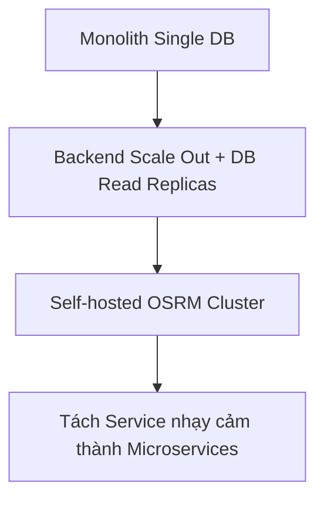

# Architecture Overview - AI Smart Travel Planner

## 1. Sơ đồ kiến trúc tổng quan
Hệ thống được thiết kế theo mô hình **Stateless Backend** nhằm tối ưu hóa khả năng mở rộng (horizontal scaling) và giảm tải tài nguyên hệ thống. Giao diện người dùng Web và Di động giao tiếp với Backend thông qua REST API bảo mật.

```text
                               ┌─────────────────┐
                               │   Clients Web   │ (Leaflet, OpenStreetMap)
                               └────────┬────────┘
                                        │ HTTPS
                                        ▼
┌────────────────────────────────────────────────────────────────────────┐
│                        API Gateway & Load Balancer                     │
│                        (Nginx / AWS ALB / Cloudflare)                  │
└───────────────────────────────────────┬────────────────────────────────┘
                                        │
                         ┌──────────────┴──────────────┐
                         ▼ (Round Robin / Least Conn)  ▼
┌────────────────────────────────────────┐    ┌──────────────────────────┐
│             Stateless Backend          │    │      Stateless Backend   │
│             Java Spring Boot (JVM)     │    │      Java Spring Boot    │
│  [Auth] [Place] [Trip] [Route] [Weather]│   │                          │
└────────┬───────────┬────────────┬──────┘    └─────┬────────────────────┘
         │           │            │                 │
         ▼           ▼            ▼                 ▼
 ┌───────────────┐ ┌──────────┐ ┌──────────────────────┐ ┌───────────────┐
 │  PostgreSQL   │ │  Redis   │ │     External APIs    │ │Object Storage │
 │    PostGIS    │ │  Cache   │ │ OSRM, Gemini, Weather│ │    + CDN      │
 └───────────────┘ └──────────┘ └──────────────────────┘ └───────────────┘
```

---

## 2. Các thành phần chính trong kiến trúc

### 2.1 API Gateway & Load Balancer
- **Hiện tại (MVP)**: Sử dụng **Nginx** làm Reverse Proxy để điều phối request từ Web client đến backend Spring Boot, đồng thời xử lý SSL termination và cấu hình CORS.
- **Tương lai (Future Scale)**: Chuyển dịch sang sử dụng **AWS ALB (Application Load Balancer)** hoặc **Nginx Cluster** hỗ trợ tự động mở rộng theo tải (Auto-scaling).

### 2.2 Stateless Backend
- Bộ máy backend được xây dựng trên **Java 21 và Spring Boot 3.x**.
- **Tính chất Stateless**: Không lưu trữ trạng thái phiên làm việc (HTTP Session) trong bộ nhớ của server. Mọi thông tin xác thực đều dựa trên JWT token được gửi trong header của mỗi request. Điều này cho phép chạy song song hàng chục instance backend phía sau Load Balancer mà không gặp lỗi đồng bộ phiên.

### 2.3 Layer Dữ liệu & Caching
- **PostgreSQL + PostGIS**: Nguồn dữ liệu tin cậy duy nhất (Single Source of Truth) cho thông tin người dùng, địa điểm (sử dụng spatial indices), lịch trình du lịch và cache tuyến đường OSRM.
- **Redis Cache**: Đảm nhận lưu trữ các dữ liệu tạm thời có tần suất truy cập cao (thông tin thời tiết theo ngày, token metadata, lượt đếm rate limit) giúp giảm tối đa tải truy vấn trực tiếp vào PostgreSQL.

### 2.4 CDN & Object Storage
- Toàn bộ static assets (ảnh địa điểm, ảnh đại diện user, các file tài nguyên tĩnh) được tải trực tiếp lên **MinIO / AWS S3 (Object Storage)** và phân phối qua **Cloudflare CDN**. Backend tuyệt đối không lưu trữ hoặc phục vụ trực tiếp các file tĩnh nặng để giải phóng băng thông và CPU.

### 2.5 Monitoring & Logging
- **Logback + SLF4J**: Xuất log có cấu trúc dưới định dạng JSON, đính kèm Correlation ID giúp dễ dàng truy vết lỗi xuyên suốt qua hệ thống phân tích log tập trung.
- **Spring Boot Actuator**: Cung cấp các thông số sức khỏe hệ thống phục vụ thu thập tự động.

---

## 3. Scaling Path (Lộ trình mở rộng hệ thống)



1. **Giai đoạn 1 (Hiện tại)**: Monolith với 1 DB PostgreSQL và 1 Redis local. Phù hợp cho lượng người dùng nhỏ dưới 10,000 active users.
2. **Giai đoạn 2 (Scale Out Backend & DB)**: 
   - Triển khai nhiều instance Backend chạy song song sau Load Balancer.
   - Thiết lập cấu trúc cơ sở dữ liệu PostgreSQL gồm 1 Master (xử lý ghi) và nhiều Read Replicas (xử lý đọc dữ liệu địa điểm, tìm kiếm).
3. **Giai đoạn 3 (Self-hosted OSRM & API Cache)**:
   - Thay thế việc gọi OSRM public server bằng cụm máy chủ tự host OSRM (OSRM cluster) để không bị rate limit và giảm độ trễ tính toán tuyến đường xuống dưới `50ms`.
4. **Giai đoạn 4 (Tách Microservices)**:
   - Khi lượng người dùng tăng mạnh, thực hiện bóc tách các module có tải cao hoặc cần tính bảo mật độc lập (ví dụ: `auth` module, `route` module) thành các microservices riêng biệt.
