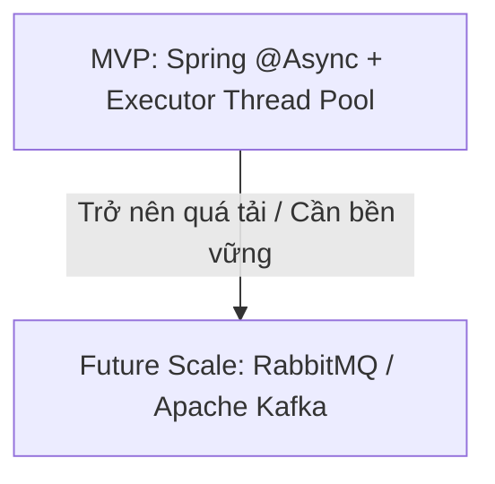

# Async & Queue Design - AI Smart Travel Planner

Tài liệu này đặc tả kiến trúc xử lý bất đồng bộ (Asynchronous) và thiết kế hàng đợi thông điệp (Message Queue) của hệ thống nhằm tối ưu hóa hiệu năng, giảm độ trễ cho các tác vụ tốn thời gian.

---

## 1. Lý do cần xử lý bất đồng bộ & Hàng đợi
Trong một ứng dụng thực tế, nhiều tác vụ tốn nhiều thời gian xử lý hoặc có độ trễ lớn do phụ thuộc vào bên thứ ba. Nếu xử lý đồng bộ (synchronous), client sẽ phải chờ đợi lâu, làm tắc nghẽn thread pool của web server, dẫn đến sập hệ thống khi có lượng truy cập lớn.

### Các tác vụ bắt buộc phải xử lý bất đồng bộ:
- **Đồng bộ dữ liệu địa điểm**: Quá trình kéo dữ liệu từ Google Places API, OpenStreetMap và Nominatim về PostgreSQL.
- **Xử lý hình ảnh**: Tự động tạo ảnh thu nhỏ (thumbnail), resize kích thước ảnh địa điểm sau khi tải lên.
- **Gửi Email/Thông báo**: Gửi email kích hoạt, email đặt lại mật khẩu, gửi push notification nhắc nhở lịch trình.
- **Ghi nhật ký hệ thống & Analytics**: Ghi audit log, thống kê lượng token sử dụng cho Gemini API.
- **Background Refresh Cache**: Chủ động gọi OSRM hoặc Weather API để làm mới cache vào ban đêm hoặc khi cache sắp hết hạn.

---

## 2. Chiến lược triển khai: MVP so với Future Scale

### 2.1 Giai đoạn MVP (Không dùng Queue ngoài)
- **Giải pháp**: Sử dụng tính năng **`@Async` của Spring Boot** kết hợp cấu hình `ThreadPoolTaskExecutor` (Executor Thread Pool) để chạy các tác vụ bất đồng bộ trên các thread tách biệt của JVM.
- **Lợi ích**: Không làm phức tạp hóa kiến trúc hạ tầng, không phát sinh chi phí cài đặt và vận hành hàng đợi ngoài ở giai đoạn đầu.
- **Hạn chế**: Nếu server bị tắt đột ngột, các tác vụ đang chờ trong RAM sẽ bị mất.

### 2.2 Giai đoạn mở rộng (Future Scale)
Khi hệ thống có hàng triệu người dùng, ta sẽ tích hợp Message Queue chuyên dụng:
- **RabbitMQ**: Lựa chọn tối ưu cho các tác vụ cần định tuyến thông điệp phức tạp (routing key), đảm bảo độ tin cậy giao nhận thông điệp cao (gửi email, xử lý ảnh, đồng bộ địa điểm).
- **Apache Kafka**: Lựa chọn khi cần xử lý lượng luồng dữ liệu (data streaming) cực lớn, ghi nhận log sự kiện hệ thống (audit logs, analytics, tracking user behavior).

---

## 3. Quản lý lỗi trong Queue: Retry & Dead Letter Queue (DLQ)
Đối với các tác vụ bất đồng bộ thất bại (ví dụ: gửi email lỗi do server mail bị chặn), hệ thống áp dụng cơ chế:
- **Retry Policy**: Tự động thử lại tối đa 3 lần với khoảng thời gian tăng dần (Exponential Backoff - ví dụ: lần đầu sau 5s, lần hai sau 30s, lần ba sau 5 phút).
- **Dead Letter Queue (DLQ - Hàng đợi thư chết)**: Nếu sau 3 lần retry vẫn thất bại, thông điệp sẽ được chuyển vào một hàng đợi đặc biệt (DLQ). Hệ thống sẽ dừng xử lý tự động để tránh làm tắc nghẽn queue chính, đồng thời ghi nhận log/cảnh báo để Admin rà soát thủ công.

---

## 4. Tính Idempotency (Tránh trùng lặp)
Do các hàng đợi trong thực tế hoạt động theo cơ chế **"At-least-once delivery" (Ít nhất một lần nhận)**, một thông điệp có thể bị gửi trùng lặp.
- **Giải pháp**: Mỗi message gửi vào queue bắt buộc đi kèm một `messageId` (UUID) duy nhất.
- **Hiện thực**: Khi Consumer nhận được message, nó sẽ kiểm tra trong Redis xem `messageId` này đã được xử lý chưa. Nếu đã xử lý, consumer lập tức bỏ qua (acknowledge và discard) để tránh chạy lại nghiệp vụ (ví dụ: gửi 2 email trùng lặp cho 1 giao dịch).

---

## 5. Transactional Outbox Pattern (Tương lai)
Khi tách dịch vụ, để tránh tình trạng ghi cơ sở dữ liệu thành công nhưng gửi message sang Queue thất bại (hoặc ngược lại):
- **Giải pháp**: Áp dụng **Outbox Pattern**. Thay vì gửi trực tiếp sang queue, Use Case sẽ ghi thông điệp vào bảng `outbox_messages` trong cùng một database transaction với nghiệp vụ chính. Một background worker độc lập (như Debezium hoặc Spring Scheduler) sẽ liên tục đọc bảng này, gửi sang Message Queue và đánh dấu đã gửi thành công.
