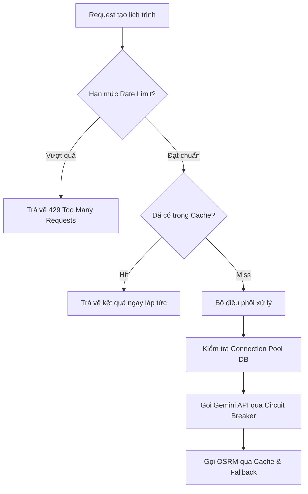

# Scalability Plan - AI Smart Travel Planner

Tài liệu này đặc tả chiến lược nâng cao khả năng chịu tải (Scalability) của hệ thống nhằm phục vụ từ giai đoạn MVP đến khi đạt hàng triệu người dùng hoạt động đồng thời.

---

## 1. Bản đồ tổng thể các giải pháp Scalability

| Thành phần | Giai đoạn MVP (Hiện tại) | Giai đoạn Scale Lớn (Tương lai) |
| :--- | :--- | :--- |
| **Backend Servers** | 1 Instance ảo | Cụm Auto-scaling, Stateless Backend |
| **Database** | 1 PostgreSQL (Single Write/Read) | 1 Master Write + Cụm Read Replicas |
| **Caching** | Redis Local (Single Instance) | Redis Cluster (Sharded) |
| **Routing Engine** | OSRM Demo Public Server | Self-hosted OSRM Cluster sau Load Balancer |
| **Tìm kiếm** | SQL LIKE / ILIKE | Elasticsearch Cluster |
| **Xử lý ngầm** | RAM-based `@Async` thread pool | RabbitMQ / Apache Kafka |

---

## 2. Các trụ cột mở rộng hệ thống (Core Pillars)

### 2.1 Stateless Horizontal Scaling (Mở rộng quy mô Backend)
Do backend thiết kế hoàn toàn không lưu trạng thái (Stateless), khi lượng truy cập tăng cao, ta chỉ cần nhân bản số lượng container Spring Boot chạy song song phía sau Load Balancer. Nginx hoặc AWS ALB sẽ phân phối đều traffic thông qua các thuật toán cân bằng tải như Round Robin.

### 2.2 PostgreSQL Read Replicas
Trong các ứng dụng du lịch, tỷ lệ đọc dữ liệu (`SELECT` tìm kiếm địa điểm, xem lịch trình đã lưu) chiếm tới `90%` tổng số truy vấn, trong khi ghi (`INSERT` đăng ký, lưu lịch trình) chỉ chiếm `10%`.
- **Giải pháp**: Thiết lập 1 DB Master chính xử lý ghi dữ liệu và đồng bộ bất đồng bộ sang 2 hoặc nhiều **Read Replicas** để gánh toàn bộ truy vấn đọc.

### 2.3 Elasticsearch cho Tìm kiếm nâng cao
Khi cơ sở dữ liệu địa điểm phình to lên hàng trăm ngàn điểm, việc tìm kiếm văn bản tự do bằng SQL sẽ gây quá tải CPU của database. Chúng ta sẽ đồng bộ dữ liệu sang **Elasticsearch Cluster** để phục vụ tìm kiếm nhanh (full-text search, fuzzy search) với độ trễ dưới `20ms`.

---

## 3. Kịch bản tải cao: Hàng triệu người dùng cùng lúc tạo chuyến đi (`POST /trips/generate`)

Đây là endpoint phức tạp nhất do đòi hỏi sự phối hợp của nhiều bên. Các điểm nghẽn (Bottlenecks) tiềm ẩn và giải pháp xử lý:

### 3.1 Điểm nghẽn 1: Gemini API Quota Limit
- **Tác động**: Google giới hạn số lượng request/phút (RPM) và token/phút (TPM) cho mỗi API Key. Hàng triệu request đồng thời sẽ làm cạn kiệt hạn mức ngay lập tức.
- **Giải pháp**: 
  - Kích hoạt **Rate Limiting khắt khe** trên endpoint này.
  - Sử dụng chiến lược normalize prompt (loại bỏ khoảng trắng, dấu câu thừa) và thực hiện băm MD5 để kiểm tra cache trước khi gọi Gemini.
  - Thiết lập cơ chế xoay vòng (rotating) nhiều API Keys hoặc sử dụng Enterprise Gateway để chia tải.

### 3.2 Điểm nghẽn 2: Độ trễ OSRM Routing Engine
- **Tác động**: Tính toán đường đi giữa 5 điểm trong ngày cho chuyến đi 3 ngày đòi hỏi tính toán liên tiếp nhiều chặng.
- **Giải pháp**:
  - Bắt buộc kiểm tra `route_cache` trước khi gọi OSRM.
  - Thực hiện gọi hàng loạt (batch request) thay vì gọi tuần tự trong vòng lặp.
  - Triển khai self-hosted OSRM instance cấu hình tối ưu cấu trúc RAM của server để trả về kết quả nhanh nhất.

### 3.3 Điểm nghẽn 3: Database Connection Pool Exhaustion
- **Tác động**: Khi hàng ngàn request cùng chờ phản hồi từ Gemini API (mất 2-3s), nếu backend giữ kết nối DB (Connection) trong suốt thời gian này, connection pool (HikariCP) sẽ cạn kiệt, làm sập toàn bộ các API khác.
- **Giải pháp**: Giải phóng kết nối DB sớm. Backend chỉ mở connection để lấy danh sách places, sau đó đóng connection trước khi thực hiện gọi sang Gemini/OSRM API. Khi có kết quả thô, mới mở lại connection để lưu trữ và trả về client.
