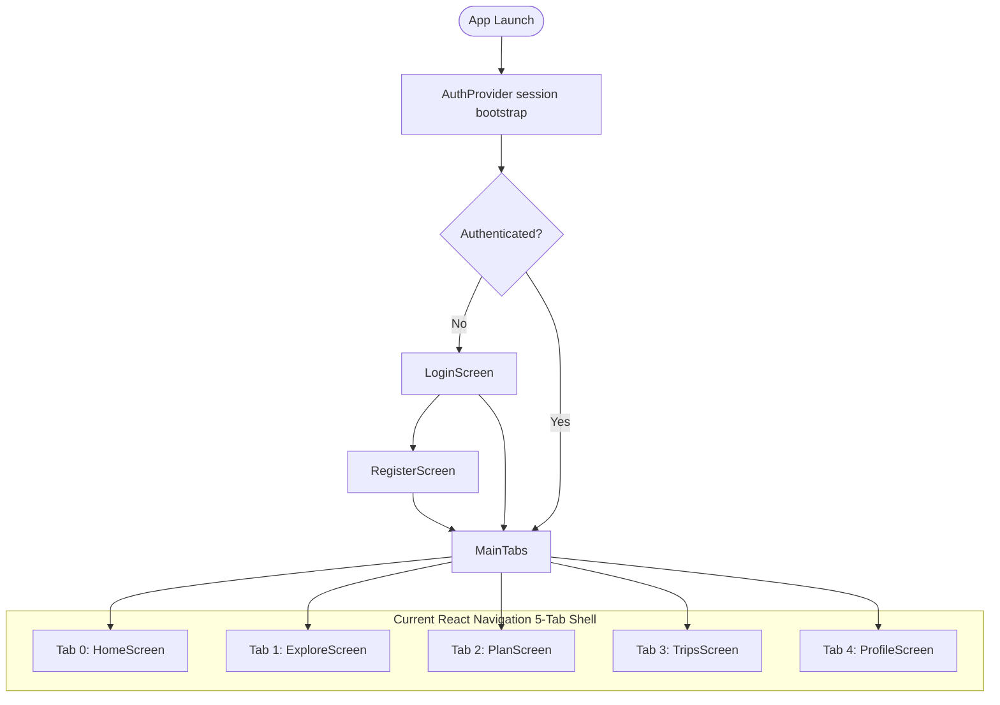

# Mobile Navigation Flow (TripWise)

> **Authority:** This document defines the screen-to-screen navigation graphs, main tab hierarchy, deep links, and back-stack rules for TripWise Mobile.

---

## 1. Top-Level Flow Diagram



---

## 2. Feature Flow Specifications

### 2.1 Explore & Place Discovery Flow
```
ExploreScreen (Tab 1)
   ├── [Tap Marker / Card] ──> SelectedPlaceModal (Bottom Sheet)
   │                              ├── [Tap Header / Card] ──> PlaceDetailScreen
   │                              │                              ├── [Add to Trip] ──> AddPlaceBottomSheet
   │                              │                              └── [Directions]  ──> RoutePreviewScreen
   │                              └── [Tap Directions]    ──> RoutePreviewScreen
   │                                                             ├── [Options] ──> RouteOptionsScreen
   │                                                             └── [Steps]   ──> RouteDetailScreen
   └── [Search Bar Tap]     ──> SearchOverlay / PlaceList
```

### 2.2 Trip Management & AI Wizard Flow
```
TripsScreen (Tab 3)
   ├── [Tap Trip Card] ──────> TripDetailScreen
   └── [Tap "+ Plan Trip"] ──> CreateTripScreen (Wizard)
                                  ├── Step 1: Destination & Dates (TravelDatesStep)
                                  ├── Step 2: Trip Preferences (TripPreferencesStep)
                                  ├── Step 3: Travel Pace (TravelPaceStep)
                                  ├── Step 4: Budget Tier (BudgetStep)
                                  ├── Step 5: Summary Review (TripSummaryStep)
                                  └── [Generate] ──> CreateTripSuccessScreen
                                                         └── [View Itinerary] ──> TripDetailScreen
```

### 2.3 Itinerary Detail & Trip Map Flow
```
TripDetailScreen
   ├── [Tap Day Pill] ───────> Switch Active Timeline Day (1, 2, 3...)
   ├── [Tap Stop Card] ──────> PlaceDetailScreen
   ├── [Tap "View Map"] ─────> TripMapScreen (Day-by-Day Polyline Route)
   └── [Tap "+ Add Place"] ──> AddPlaceBottomSheet ──> (Appends Stop to Day)
```

### 2.4 Profile & Settings Flow
```
ProfileScreen (Tab 4)
   ├── [Edit Profile] ──> EditProfileScreen
   ├── [Settings] ──────> SettingsScreen
   │                         ├── [Language] ──> LanguageScreen
   │                         ├── [Currency] ──> CurrencyScreen
   │                         ├── [Help]     ──> HelpSupportScreen
   │                         └── [Delete]   ──> DeleteAccountDialog (Modal)
   └── [Sign Out] ──────> SignOut confirmation/action ──> LoginScreen
```

---

## 3. Back-Navigation & History Stack Rules

1. **Root Tabs (Home, Explore, Plan, Trips, Profile):**
   - Current source is `mobile/src/navigation/MainTabs.tsx`. Android back behavior must follow React Navigation and be verified before adding custom tab fallback logic.
2. **Bottom Sheets (`SelectedPlaceModal`, `AddPlaceBottomSheet`):**
   - System back button or dragging down collapses the sheet without navigating away from the parent screen.
3. **Wizard Flow (`CreateTripScreen`):**
   - Back arrow navigates to the previous step in the wizard (Step 4 → Step 3 → Step 2 → Step 1).
   - Back from Step 1 prompts a modal: *"Discard trip draft?"*.
4. **Detail Screens (`PlaceDetailScreen`, `RouteDetailScreen`, `TripMapScreen`):**
   - Top-left back icon pops the stack to the exact invoking screen.
